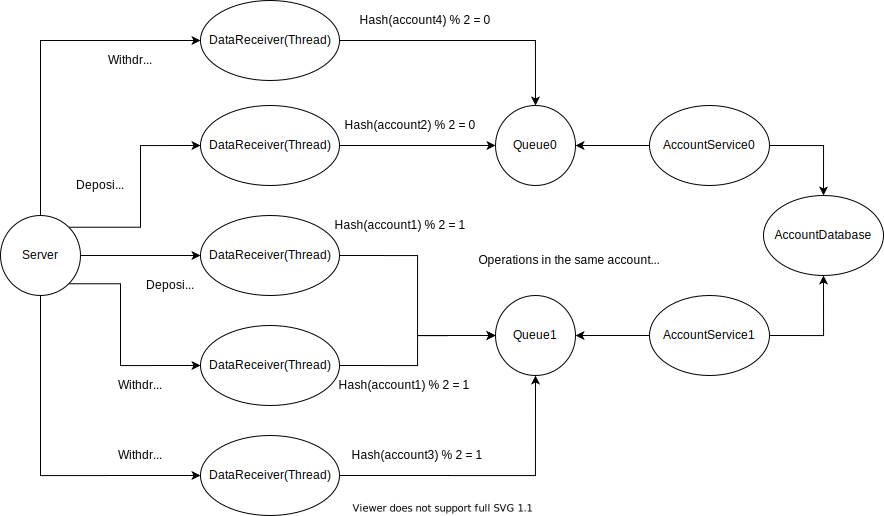

# Multi-threading-Socket-Internet-Banking

TCP Server for Internet Banking

## Architecture



## Running the server

```
python3 server.py
```

## Running multiple clients

Linux:
```
python3 client.py 0 deposit 100 &
python3 client.py 0 withdrawal 100 &
python3 client.py 1 deposit 200 &
python3 client.py 0 deposit 300 &
python3 client.py 1 withdrawal 100
```

Windows:
```
start "" python client.py 0 deposit 100
start "" python client.py 0 withdrawal 100
start "" python client.py 1 deposit 200
start "" python client.py 0 deposit 300
start "" python client.py 1 withdrawal 100
```

## References

- [Python Parallel Socket Connections](https://stackoverflow.com/questions/56066453/python-parallel-socket-connections)
- [Python Threading Pool](https://stackoverflow.com/questions/3033952/threading-pool-similar-to-the-multiprocessing-pool)
- [A synchronized queue class](https://docs.python.org/3/library/queue.html)
- [Inside NGINX: Designed for Performance & Scalability](https://www.nginx.com/blog/inside-nginx-how-we-designed-for-performance-scale)
- [Socket programming multithreading python](https://www.geeksforgeeks.org/socket-programming-multi-threading-python/)
